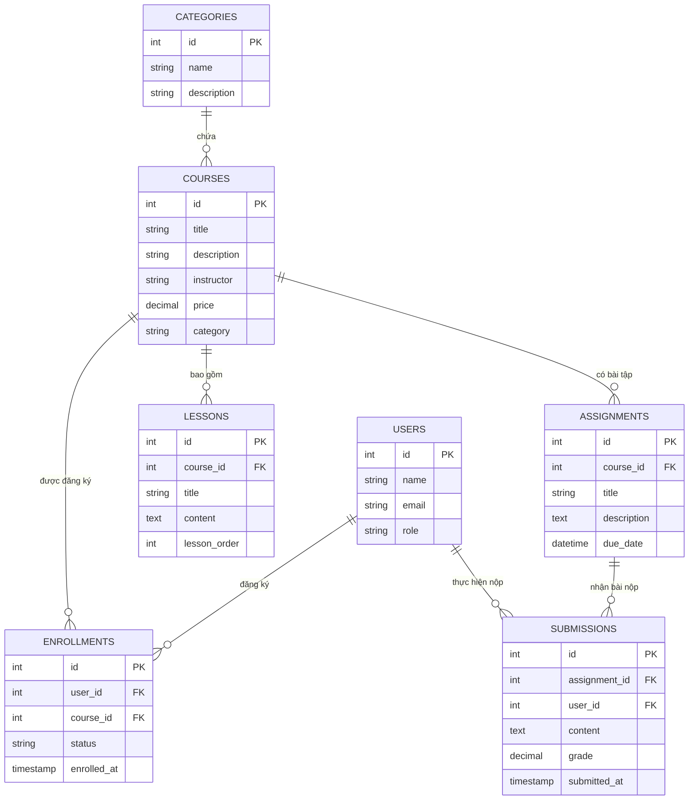

# BÁO CÁO TỔNG QUAN HIỆN TRẠNG DỰ ÁN ONLINE LEARNING SYSTEM

> **Ngày cập nhật:** Tháng 10/2026  
> **Phiên bản:** 1.0.0 (CQ6.2 Edition)  
> **Kiến trúc:** 3-Tier Web Application (React Client – Node.js/Express API – MySQL Database)

---

## 1. Tổng quan & Hiện trạng dự án (Current Status)

Dự án **Online Learning System (Hệ thống Quản lý Học trực tuyến)** hiện đã hoàn thiện đầy đủ kiến trúc Full-stack với tính năng quản trị CRUD hoàn chỉnh cho tất cả các đối tượng dữ liệu trong một nền tảng E-Learning tiêu chuẩn.

### Tình trạng sẵn sàng
- **Cơ sở dữ liệu (Database):** Hoàn thiện 100% với 7 bảng dữ liệu quan hệ, ràng buộc khóa ngoại (Foreign Keys) với cơ chế xóa theo tầng (`ON DELETE CASCADE`), kèm dữ liệu mẫu (seed data) sẵn sàng phục vụ kiểm thử.
- **Backend (API):** Hoàn thiện 100% kiến trúc MVC (Model - Controller - Route), xử lý truy vấn tham số hóa (Parameterized Queries) chống tấn công SQL Injection, CORS, xử lý lỗi tập trung (Global Error Handler) và Endpoint thống kê Dashboard.
- **Frontend (Web App):** Hoàn thiện 100% giao diện quản trị với React 18 & TypeScript, hỗ trợ đầy đủ 8 trang giao diện (Dashboard + 7 module CRUD), Modal thêm/sửa, tìm kiếm thời gian thực, thông báo Toast tự động và thiết kế Responsive hỗ trợ thiết bị di động.

---

## 2. Ngăn xếp công nghệ (Tech Stack)

### 2.1. Frontend
- **Framework & Thư viện lõi:** [React 18.3.1](https://react.dev/) + [TypeScript 5.4.5](https://www.typescriptlang.org/)
- **Công cụ xây dựng (Build Tool):** [Vite 5.2.13](https://vitejs.dev/) (khởi động nhanh, Hot Module Replacement siêu tốc)
- **Điều hướng (Routing):** `react-router-dom` (v7)
- **Giao tiếp API (HTTP Client):** `axios` (v1.7.2) với cấu hình baseURL linh hoạt từ biến môi trường
- **Bộ Icon:** `lucide-react` (bộ icon vector hiện đại, sắc nét)
- **Styling & CSS:** **Custom Vanilla CSS Design System** (tự thiết kế hoàn toàn, không phụ thuộc Tailwind hay Bootstrap, sử dụng biến CSS Tokens, hiệu ứng Glassmorphism và vi mô vi hoạt ảnh mượt mà)

### 2.2. Backend
- **Nền tảng chạy (Runtime):** [Node.js](https://nodejs.org/)
- **Web Framework:** [Express.js 4.19.2](https://expressjs.com/)
- **Database Driver:** `mysql2` (v3.9.7) hỗ trợ Connection Pool và cú pháp Async/Await với Promise wrapper
- **Middleware & Tiện ích:**
  - `cors`: Hỗ trợ Cross-Origin Resource Sharing giữa Frontend và Backend
  - `dotenv`: Quản lý cấu hình biến môi trường an toàn
  - `nodemon`: Tự động khởi động lại server khi có thay đổi code trong môi trường phát triển

### 2.3. Cơ sở dữ liệu (Database)
- **Hệ quản trị CSDL:** MySQL 8.x
- **Bảng mã & Đối chiếu:** `utf8mb4_unicode_ci` (hỗ trợ lưu trữ tiếng Việt có dấu và emoji đầy đủ)
- **Engine lưu trữ:** InnoDB (đảm bảo tính toàn vẹn dữ liệu ACID và khóa ngoại)

---

## 3. Cấu trúc dự án & Những thành phần đang có

Dự án được phân chia theo mô hình **Monorepo / Tách biệt Client - Server** rõ ràng:

```
online-learning-crud/
├── schema.sql                         # Kịch bản khởi tạo CSDL & Seed data
├── README.md                          # Tài liệu hướng dẫn cài đặt & vận hành
├── PROJECT_OVERVIEW.md                # Báo cáo tổng quan hiện trạng dự án
│
├── backend/                           # Dịch vụ Backend REST API (Node.js/Express)
│   ├── .env                           # File cấu hình môi trường Backend
│   ├── .env.example                   # Mẫu cấu hình môi trường
│   ├── package.json                   # Dependencies & npm scripts của Backend
│   ├── schema.sql                     # Bản sao schema CSDL
│   └── src/
│       ├── app.js                     # Điểm khởi động Express server & đăng ký route
│       ├── config/
│       │   └── db.js                  # Cấu hình MySQL Pool Connection
│       ├── controllers/               # Xử lý logic nghiệp vụ và trả lời HTTP Request
│       │   ├── dashboardController.js # Thống kê số lượng tổng quan
│       │   ├── courseController.js    # Nghiệp vụ khóa học
│       │   ├── userController.js      # Nghiệp vụ người dùng
│       │   ├── categoryController.js  # Nghiệp vụ danh mục
│       │   ├── lessonController.js    # Nghiệp vụ bài học
│       │   ├── enrollmentController.js# Nghiệp vụ đăng ký khóa học
│       │   ├── assignmentController.js# Nghiệp vụ bài tập
│       │   └── submissionController.js# Nghiệp vụ bài nộp & chấm điểm
│       ├── models/                    # Tầng giao tiếp trực tiếp với CSDL (Raw SQL)
│       │   ├── courseModel.js
│       │   ├── userModel.js
│       │   ├── categoryModel.js
│       │   ├── lessonModel.js
│       │   ├── enrollmentModel.js
│       │   ├── assignmentModel.js
│       │   └── submissionModel.js
│       └── routes/                    # Khai báo đường dẫn API RESTful
│           ├── dashboardRoutes.js
│           ├── courseRoutes.js
│           ├── userRoutes.js
│           ├── categoryRoutes.js
│           ├── lessonRoutes.js
│           ├── enrollmentRoutes.js
│           ├── assignmentRoutes.js
│           └── submissionRoutes.js
│
└── frontend/                          # Ứng dụng Giao diện Quản trị (React + TypeScript)
    ├── .env                           # File cấu hình môi trường Frontend
    ├── .env.example                   # Mẫu biến môi trường (VITE_API_BASE_URL)
    ├── index.html                     # HTML Template chính
    ├── package.json                   # Dependencies & scripts Frontend
    ├── tsconfig.json                  # Cấu hình TypeScript
    ├── vite.config.ts                 # Cấu hình Vite build
    └── src/
        ├── App.tsx                    # Cấu hình định tuyến (React Router)
        ├── main.tsx                   # Điểm nạp React DOM
        ├── index.css                  # Hệ thống Design Tokens & Toàn bộ Stylesheet
        ├── components/                # Các thành phần giao diện tái sử dụng
        │   ├── Layout.tsx             # Khung sườn giao diện (Sidebar + Header + Body)
        │   ├── Sidebar.tsx            # Thanh điều hướng trái với menu đa năng
        │   ├── Header.tsx             # Thanh tiêu đề trên cùng với nút mở menu mobile
        │   ├── CourseList.tsx / CourseForm.tsx
        │   ├── UserList.tsx / UserForm.tsx
        │   ├── CategoryList.tsx / CategoryForm.tsx
        │   ├── LessonList.tsx / LessonForm.tsx
        │   ├── EnrollmentList.tsx / EnrollmentForm.tsx
        │   ├── AssignmentList.tsx / AssignmentForm.tsx
        │   └── SubmissionList.tsx / SubmissionForm.tsx
        ├── pages/                     # Các màn hình chính theo route
        │   ├── DashboardPage.tsx      # Trang tổng quan thống kê số liệu
        │   ├── CoursesPage.tsx        # Trang quản lý khóa học
        │   ├── UsersPage.tsx          # Trang quản lý tài khoản người dùng
        │   ├── CategoriesPage.tsx     # Trang quản lý thể loại / danh mục
        │   ├── LessonsPage.tsx        # Trang quản lý bài giảng
        │   ├── EnrollmentsPage.tsx    # Trang quản lý danh sách đăng ký
        │   ├── AssignmentsPage.tsx    # Trang quản lý bài tập
        │   └── SubmissionsPage.tsx    # Trang chấm bài & quản lý bài nộp
        ├── services/                  # Tầng gọi API qua Axios
        │   ├── dashboardApi.ts
        │   ├── courseApi.ts
        │   ├── userApi.ts
        │   ├── categoryApi.ts
        │   ├── lessonApi.ts
        │   ├── enrollmentApi.ts
        │   ├── assignmentApi.ts
        │   └── submissionApi.ts
        └── types/                     # Định nghĩa kiểu dữ liệu TypeScript (Interfaces)
            ├── dashboard.ts
            ├── course.ts
            ├── user.ts
            ├── category.ts
            ├── lesson.ts
            ├── enrollment.ts
            ├── assignment.ts
            └── submission.ts
```

---

## 4. Chi tiết các tính năng của hệ thống (System Features)

Hệ thống cung cấp trọn vẹn chu trình CRUD và quản lý mối quan hệ cho 8 phân hệ cốt lõi:

| Phân hệ | Tính năng chi tiết | Mô tả nghiệp vụ |
| :--- | :--- | :--- |
| **1. Dashboard (Tổng quan)** | • Thống kê số lượng thời gian thực<br>• 7 thẻ chỉ số chính<br>• Phím tắt điều hướng nhanh | Hiển thị tổng số lượng: Khóa học, Học viên/Giảng viên, Danh mục, Bài giảng, Đăng ký học, Bài tập và Bài nộp kèm liên kết trực tiếp đến từng trang. |
| **2. Quản lý Khóa học (`/courses`)** | • Xem danh sách khóa học<br>• Tìm kiếm tức thời theo tiêu đề/mô tả<br>• Thêm mới khóa học<br>• Cập nhật thông tin<br>• Xóa khóa học | Quản lý tiêu đề, mô tả tóm tắt, tên giảng viên phụ trách, học phí (hỗ trợ hiển thị badge "Miễn phí" khi giá bằng 0) và danh mục liên kết. |
| **3. Quản lý Người dùng (`/users`)** | • Quản lý tài khoản<br>• Phân loại 3 vai trò (Student, Instructor, Admin)<br>• Tìm kiếm theo tên/email<br>• Thêm, sửa, xóa | Lưu trữ họ tên, email định danh duy nhất (Unique Index), phân quyền theo Role với các badge màu phân biệt riêng biệt. |
| **4. Quản lý Danh mục (`/categories`)** | • Phân loại chuyên mục đào tạo<br>• Tìm kiếm danh mục<br>• Thêm mới, chỉnh sửa, xóa | Quản lý tên chuyên ngành đào tạo (Web Dev, Data Science, Mobile Dev, DevOps...) kèm phần mô tả chi tiết. |
| **5. Quản lý Bài học (`/lessons`)** | • Gắn bài giảng vào từng khóa học<br>• Quản lý thứ tự bài (`lesson_order`)<br>• Xem nội dung bài học<br>• Thêm, sửa, xóa | Sử dụng khóa ngoại liên kết tới khóa học, hiển thị tên khóa học tương ứng, sắp xếp theo trình tự giảng dạy. |
| **6. Quản lý Đăng ký (`/enrollments`)** | • Ghi danh học viên vào khóa học<br>• Quản lý 3 trạng thái (`active`, `completed`, `cancelled`)<br>• Theo dõi ngày ghi danh<br>• Thêm, sửa, hủy đăng ký | Kết nối bảng `users` và `courses`. Hiển thị tên học viên, email và khóa học đã đăng ký kèm badge trạng thái học tập. |
| **7. Quản lý Bài tập (`/assignments`)** | • Tạo bài tập cho khóa học<br>• Thiết lập hạn nộp (`due_date`)<br>• Mô tả yêu cầu bài tập<br>• Thêm, sửa, xóa | Giáo viên giao nhiệm vụ và hạn hoàn thành theo từng khóa học; hiển thị định dạng ngày giờ trực quan. |
| **8. Quản lý Bài nộp & Chấm điểm (`/submissions`)** | • Tiếp nhận bài nộp của học viên<br>• Hỗ trợ nội dung text hoặc URL repo GitHub<br>• Chấm điểm số (thang điểm 100)<br>• Cập nhật điểm & phản hồi | Liên kết bài tập và học viên; hiển thị badge điểm số (hoặc nhãn "Chờ chấm" nếu chưa có điểm); hỗ trợ mở nhanh link bài làm. |

### Các tính năng bổ trợ dùng chung trên toàn hệ thống:
1. **Tìm kiếm thời gian thực (Live Search):** Tất cả các trang danh sách đều tích hợp thanh tìm kiếm không cần reload trang, kèm nút xóa nhanh từ khóa (Clear search).
2. **Modal Form (Cửa sổ thêm/sửa chuyên dụng):** Không chuyển trang khi tạo hoặc cập nhật bản ghi, đảm bảo trải nghiệm liền mạch cho người quản trị.
3. **Modal xác nhận an toàn (Confirmation Dialog):** Cảnh báo người dùng trước các hành động xóa dữ liệu nguy hiểm để tránh xóa nhầm.
4. **Hệ thống thông báo Toast (Toast Notifications):** Thông báo trạng thái thành công hoặc báo lỗi màu xanh/đỏ tự động hiển thị ở góc trên màn hình và tự tắt sau 3 giây.
5. **State Feedback đầy đủ:** Xử lý hiệu ứng xoay (Loading Spinner), màn hình thông báo rỗng (Empty State) khi chưa có bản ghi, và màn hình báo lỗi (Error State) kèm nút Thử lại (Retry).

---

## 5. Thiết kế & Trải nghiệm giao diện (UI/UX Aesthetics)

Giao diện được thiết kế theo xu hướng **Modern Dashboard & E-learning Administration**, chú trọng tính thẩm mỹ, độ hoàn thiện cao và tương thích đa thiết bị:

### 5.1. Hệ thống màu sắc (Color Tokens)
- **Màu chủ đạo (Primary Brand):** Deep Indigo (`#4f46e5`) và Dark Indigo (`#4338ca`) – biểu trưng cho học thuật và công nghệ.
- **Thanh điều hướng bên (Sidebar):** Midnight Navy (`#1e1b4b`) tạo sự tách biệt đẳng cấp, điểm nhấn gradient cho mục đang chọn (Active).
- **Màu nền ứng dụng (App Background):** Slate Gray sáng (`#f1f5f9`), dịu mắt cho người dùng khi làm việc lâu.
- **Thẻ nội dung (Cards / Tables):** Nền trắng thuần (`#ffffff`), đổ bóng mềm nhiều lớp (`box-shadow: 0 4px 14px rgba(0, 0, 0, 0.06)`).
- **Màu trạng thái (Status Colors):**
  - Thành công / Đã hoàn thành / Miễn phí: Emerald Green (`#15803d` / `#dcfce7`)
  - Lỗi / Đã hủy / Admin: Carmine Red (`#b91c1c` / `#fee2e2`)
  - Đang học / Giảng viên: Indigo Sky (`#0369a1` / `#e0f2fe`)
  - Chờ chấm điểm / Điểm số: Warm Amber (`#92400e` / `#fef3c7`)

### 5.2. Kiểu chữ (Typography)
- Sử dụng font chữ tiêu chuẩn hiện đại: `'Inter', 'Outfit', system-ui, sans-serif`
- Phân cấp tiêu đề rõ ràng từ `h1` trang, `h2` modal, `card-count` số liệu lớn cho đến nhãn phụ `subtitle` xám nhạt (`#64748b`).

### 5.3. Bố cục không gian (Layout Architecture)
- **Sidebar cố định bên trái (Desktop):** Chiều rộng 260px, chứa logo, danh sách biểu tượng trực quan từ Lucide React, chân trang hiển thị phiên bản hệ thống.
- **Header cố định trên cùng (Sticky Header):** Tích hợp tiêu đề hệ thống và nút bấm Menu Hamburger dành riêng cho thiết bị màn hình nhỏ.
- **Khu vực nội dung (Content Area):** Tối ưu giới hạn độ rộng tối đa 1400px với lề chuẩn 32px giúp thông tin không bị kéo dãn quá đà trên màn hình siêu rộng (Ultra-wide).

### 5.4. Các hiệu ứng thị giác & Tương tác
- **Hover Micro-interactions:** Các thẻ Dashboard và dòng bảng khi di chuột đều có hiệu ứng nâng nhẹ (`translateY(-2px)`) kèm bóng đổ đậm hơn.
- **Glassmorphism:** Lớp nền mờ (Backdrop filter `blur(4px)` + bán trong suốt) áp dụng cho lớp phủ Modal và Mobile Menu.
- **Animation tinh tế:** Modal xuất hiện với hiệu ứng phóng nhẹ mượt mà (`modalIn 0.25s cubic-bezier`), Toast trượt nhẹ từ trên xuống (`slideIn`).

### 5.5. Khả năng tương thích di động (Responsive Breakdown)
- **Màn hình Tablet & Mobile (`< 992px`):** Sidebar tự động ẩn và chuyển thành Off-canvas Drawer có thể đóng mở qua nút bấm menu; thêm lớp phủ mờ click-to-close.
- **Màn hình Điện thoại (`< 640px`):** Form tự động gập từ 2 cột về 1 cột dọc; nút hành động chuyển sang kích thước toàn màn hình; bảng dữ liệu kích hoạt thanh trượt ngang mượt mà (`overflow-x: auto`).

---

## 6. Sơ đồ CSDL & Mối quan hệ dữ liệu (Database Schema)

Hệ thống được thiết kế chuẩn hóa với 7 thực thể liên kết chặt chẽ:



---

## 7. Danh sách API Endpoints của Hệ thống

| Phương thức | Endpoint | Chức năng nghiệp vụ |
| :--- | :--- | :--- |
| `GET` | `/api/dashboard/stats` | Lấy số liệu thống kê tổng hợp số lượng của 7 bảng |
| `GET` | `/api/courses` | Lấy danh sách khóa học (hỗ trợ `?search=...`) |
| `GET` | `/api/courses/:id` | Lấy chi tiết 1 khóa học |
| `POST`| `/api/courses` | Tạo khóa học mới |
| `PUT` | `/api/courses/:id` | Cập nhật khóa học |
| `DELETE` | `/api/courses/:id` | Xóa khóa học |
| `GET` | `/api/users` | Lấy danh sách người dùng (hỗ trợ `?search=...` hoặc `?role=...`) |
| `POST`| `/api/users` | Thêm tài khoản người dùng mới |
| `PUT` | `/api/users/:id` | Sửa thông tin tài khoản |
| `DELETE` | `/api/users/:id` | Xóa người dùng |
| `GET` | `/api/categories` | Lấy toàn bộ danh mục |
| `POST`| `/api/categories` | Thêm danh mục mới |
| `PUT` | `/api/categories/:id` | Sửa danh mục |
| `DELETE` | `/api/categories/:id` | Xóa danh mục |
| `GET` | `/api/lessons` | Lấy bài học (kèm tên khóa học, hỗ trợ lọc `?course_id=...`) |
| `POST`| `/api/lessons` | Tạo bài giảng mới |
| `PUT` | `/api/lessons/:id` | Sửa bài giảng |
| `DELETE` | `/api/lessons/:id` | Xóa bài giảng |
| `GET` | `/api/enrollments` | Lấy danh sách đăng ký (kèm tên học viên & tên khóa học) |
| `POST`| `/api/enrollments` | Ghi danh học viên vào khóa học |
| `PUT` | `/api/enrollments/:id` | Đổi trạng thái ghi danh (`active`, `completed`, `cancelled`) |
| `DELETE` | `/api/enrollments/:id` | Xóa ghi danh |
| `GET` | `/api/assignments` | Lấy danh sách bài tập kèm thông tin khóa học |
| `POST`| `/api/assignments` | Tạo bài tập mới kèm thời hạn nộp |
| `PUT` | `/api/assignments/:id` | Sửa bài tập |
| `DELETE` | `/api/assignments/:id` | Xóa bài tập |
| `GET` | `/api/submissions` | Lấy bài nộp kèm tên bài tập, tên học viên và điểm số |
| `POST`| `/api/submissions` | Học viên nộp bài làm |
| `PUT` | `/api/submissions/:id` | Giảng viên chấm điểm & sửa phản hồi |
| `DELETE` | `/api/submissions/:id` | Xóa bài nộp |

---

## 8. Hướng dẫn khởi chạy nhanh dự án

### Bước 1: Khởi tạo Cơ sở dữ liệu
1. Mở công cụ **MySQL Workbench** hoặc terminal MySQL.
2. Chạy tệp tin `schema.sql` ở thư mục gốc:
   ```bash
   mysql -u root -p < schema.sql
   ```
*(Tệp tin đã bao gồm lệnh tạo cơ sở dữ liệu `online_learning_db` và khởi tạo sẵn dữ liệu mẫu cho cả 7 bảng)*.

### Bước 2: Khởi chạy Backend API
1. Truy cập thư mục backend và cài đặt thư viện:
   ```bash
   cd backend
   npm install
   ```
2. Kiểm tra/sửa file `.env` cho khớp thông tin tài khoản MySQL của bạn:
   ```env
   DB_HOST=localhost
   DB_USER=root
   DB_PASSWORD=mật_khẩu_mysql_của_bạn
   DB_NAME=online_learning_db
   DB_PORT=3306
   PORT=5000
   ```
3. Khởi động Backend:
   ```bash
   npm run dev
   ```
   *API hoạt động tại: `http://localhost:5000/api`*

### Bước 3: Khởi chạy Frontend
1. Mở cửa sổ terminal mới, truy cập thư mục frontend:
   ```bash
   cd frontend
   npm install
   ```
2. Đảm bảo file `.env` đã có cấu hình API:
   ```env
   VITE_API_BASE_URL=http://localhost:5000/api
   ```
3. Khởi động giao diện phát triển:
   ```bash
   npm run dev
   ```
   *Ứng dụng web hiển thị tại: `http://localhost:3000` hoặc `http://localhost:5173`*

---

## 9. Đánh giá hiện trạng & Hướng phát triển tiếp theo

### Điểm mạnh hiện tại
- **Kiến trúc mạch lạc, chuẩn mực:** Backend phân chia rành mạch Controller - Model - Route; Frontend phân chia Types - API Service - Components - Pages.
- **Giao diện đẳng cấp & hiện đại:** Không sử dụng thư viện UI nặng nề (như MUI/AntD) mà tự xây dựng Design System gọn nhẹ, tải siêu nhanh, hiệu ứng chuyển cảnh mượt mà.
- **Toàn vẹn dữ liệu cao:** Sử dụng quan hệ khóa ngoại thực sự trong CSDL, đảm bảo khi xóa khóa học thì bài tập, bài học và đăng ký liên quan sẽ được dọn dẹp sạch sẽ theo cascade.
- **Trải nghiệm người dùng (UX) tối ưu:** Hỗ trợ đầy đủ trạng thái Loading, Empty, Confirm Dialog, Toast Feedback, Search ngay lập tức.

### Hướng mở rộng tiềm năng
- **Bảo mật & Xác thực (Auth):** Bổ sung đăng nhập/đăng ký bằng JWT (JSON Web Token), mã hóa mật khẩu với `bcryptjs`, phân quyền Role-based Access Control trên Frontend.
- **Trang học viên chuyên biệt:** Xây dựng màn hình xem video bài giảng và làm bài trắc nghiệm trực tuyến dành riêng cho tài khoản học viên.
- **Lưu trữ tệp đa phương tiện:** Tích hợp upload video bài học và tài liệu PDF lên Cloudinary hoặc AWS S3.
- **Cổng thanh toán:** Tích hợp cổng thanh toán trực tuyến (VNPAY / MoMo / Stripe) cho các khóa học trả phí.
